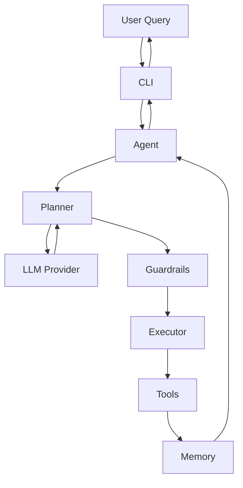
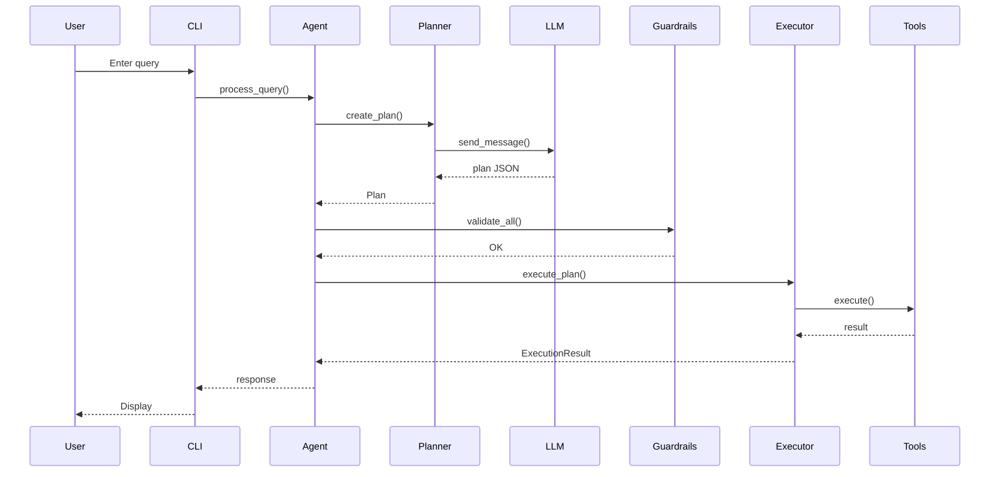

# AI Agent Framework - Comprehensive Review & Improvement Suggestions

**Review Date:** 2025-11-22  
**Project:** AI Agent Framework (Rust)  
**Architecture:** 12-crate workspace with 3-layer design

---

## 📋 Table of Contents

- [Executive Summary](#executive-summary)
- [Critical Issues](#-critical-issues-fix-immediately)
- [High Priority Improvements](#-high-priority-improvements)
- [Medium Priority Enhancements](#-medium-priority-enhancements)
- [Nice-to-Have Features](#-nice-to-have-features)
- [Documentation Improvements](#-documentation-improvements)
- [Code Quality Improvements](#-code-quality-improvements)
- [Summary & Prioritization](#-summary--prioritization)
- [Recommended Action Plan](#-recommended-action-plan)
- [Strengths to Maintain](#-strengths-to-maintain)

---

## Executive Summary

This is a **well-structured educational AI agent framework** with clean architecture, good separation of concerns, and solid documentation. The 12-crate workspace design is excellent for learning. However, there are opportunities to improve **security, reliability, performance, and production-readiness**.

**Overall Assessment:**
- ✅ Excellent architecture and code organization
- ✅ Good documentation with rustdoc comments
- ✅ Clean separation of concerns
- ⚠️ Some security concerns (API key handling, unwrap calls)
- ⚠️ Missing production features (logging, persistence, caching)
- ⚠️ Rules engine implemented but not integrated

---

## 🔴 Critical Issues (Fix Immediately)

### 1. Invalid Rust Edition in core/Cargo.toml

**Issue:** `edition = "2024"` doesn't exist

**Location:** `core/Cargo.toml` line 4

```toml
# ❌ Current (Invalid)
edition = "2024"

# ✅ Should be
edition = "2021"
```

**Impact:** This will cause compilation errors on some Rust versions.

**Priority:** 🔴 Critical  
**Effort:** 5 minutes

---

### 2. Unsafe `.unwrap()` Calls in Header Parsing

**Issue:** Panics possible when parsing API headers

**Locations:**
- `llm/src/openai/mod.rs:84`
- `llm/src/anthropic/mod.rs:111`

```rust
// ❌ Current (Can panic)
headers.insert(
    "Authorization",
    format!("Bearer {}", self.api_key).parse().unwrap()
);

// ✅ Should be
headers.insert(
    "Authorization",
    format!("Bearer {}", self.api_key)
        .parse()
        .map_err(|e| AgentError::LLMProvider(
            format!("Invalid API key format: {}", e)
        ))?
);
```

**Impact:** Production crashes if API keys contain invalid characters.

**Priority:** 🔴 Critical  
**Effort:** 30 minutes

---

### 3. API Keys in Plain Text Configuration Files

**Issue:** Documentation and examples show API keys directly in YAML files

**Current State:**
```yaml
# ✅ Good - uses env var
llm:
  api_key: ${OPENAI_API_KEY}

# ❌ Bad - shown in some documentation
llm:
  api_key: "sk-..."
```

**Recommendations:**
1. Always use environment variables for secrets
2. Add validation to reject plain-text keys in config files
3. Add security warning in documentation
4. Consider integrating with secrets managers (e.g., HashiCorp Vault)

**Priority:** 🔴 Critical  
**Effort:** 2-4 hours

---

## 🟠 High Priority Improvements

### 4. Rules Engine Not Integrated

**Issue:** The `rules` crate exists but is never used in the agent flow

**Current State:**
- ✅ Rules engine implemented with `ToneRule`, `ResponseLengthRule`
- ✅ `PlanningContext` and `RuleEngine` exist
- ❌ Planner doesn't use rules
- ❌ No way to configure rules in agent config

**Fix:**

```rust
// In planner/src/planner.rs
pub struct Planner {
    llm: Box<dyn llm::LLMProvider>,
    memory: Box<dyn memory::MemoryStore>,
    rules: rules::RuleEngine,  // ← Add this
}

impl Planner {
    pub async fn create_plan(
        &self,
        goal: &str,
        available_tools: &[ToolInfo]
    ) -> Result<Plan> {
        // Create planning context
        let base_prompt = self.build_system_prompt(available_tools);
        let mut context = PlanningContext::new(base_prompt);
        
        // Apply rules to modify context
        self.rules.apply_all(&mut context);
        
        // Use modified prompt
        let messages = vec![
            Message::system(&context.system_prompt),
            Message::user(goal),
        ];
        
        let response = self.llm.send_message(&messages).await?;
        self.parse_plan(&response)
    }
}
```

**Configuration Support:**

```yaml
# Add to config files
rules:
  - name: tone
    type: formal
  - name: response_length
    max_words: 150
```

**Priority:** 🟠 High  
**Effort:** 4-8 hours

---

### 5. No Persistent Memory Storage

**Issue:** All conversation history is lost when the program exits

**Impact:** Poor user experience for long-running conversations

**Solution:** Implement file-backed memory store

```rust
// Add to memory/src/file_backed.rs
use std::path::PathBuf;
use serde::{Serialize, Deserialize};

pub struct FileBackedStore {
    inner: InMemoryStore,
    file_path: PathBuf,
}

impl FileBackedStore {
    pub fn new(file_path: PathBuf) -> Result<Self> {
        let inner = if file_path.exists() {
            // Load from file
            let data = std::fs::read_to_string(&file_path)?;
            serde_json::from_str(&data)?
        } else {
            InMemoryStore::new()
        };

        Ok(Self { inner, file_path })
    }

    fn save(&self) -> Result<()> {
        let data = serde_json::to_string_pretty(&self.inner)?;
        std::fs::write(&self.file_path, data)?;
        Ok(())
    }
}

impl MemoryStore for FileBackedStore {
    fn add_message(&mut self, message: Message) {
        self.inner.add_message(message);
        let _ = self.save(); // Auto-save on changes
    }

    fn get_recent(&self, limit: usize) -> Vec<Message> {
        self.inner.get_recent(limit)
    }

    // ... delegate other methods
}
```

**Priority:** 🟠 High
**Effort:** 4-6 hours

---

### 6. Missing Observability & Logging

**Issue:** No structured logging, making debugging difficult

**Current State:**
- Only `println!` statements with colored output
- No log levels or filtering
- No structured data in logs

**Solution:** Add `tracing` for structured logging

```bash
# Add to workspace dependencies
cargo add tracing tracing-subscriber
```

```rust
// In cli/src/main.rs
use tracing::{info, warn, error, debug, instrument};
use tracing_subscriber::{fmt, EnvFilter};

#[tokio::main]
async fn main() -> anyhow::Result<()> {
    // Initialize tracing
    tracing_subscriber::fmt()
        .with_env_filter(
            EnvFilter::try_from_default_env()
                .unwrap_or_else(|_| EnvFilter::new("info,ai_agent_framework=debug"))
        )
        .with_target(true)
        .with_thread_ids(true)
        .init();

    info!("Starting AI Agent Framework");

    let args = CliArgs::parse();
    debug!(?args, "Parsed command-line arguments");

    // ... rest of code
}

// In executor/src/executor.rs
#[instrument(skip(self), fields(tool_name = %tool_call.tool_name))]
async fn handle_tool_call(&mut self, tool_call: &ToolCall) -> Result<StepResult> {
    debug!("Executing tool call");
    // ... implementation
}
```

**Usage:**
```bash
# Control log level via environment
RUST_LOG=debug cargo run --example chatbot
RUST_LOG=info,executor=trace cargo run --example research
```

**Priority:** 🟠 High
**Effort:** 2-4 hours

---

### 7. No Integration Tests in CI

**Issue:** Integration tests are marked `#[ignore]` and won't run automatically

**Current State:**
- Unit tests run in CI
- Integration tests require manual execution
- No automated testing of LLM providers

**Solution:** Set up GitHub Actions CI

```yaml
# .github/workflows/ci.yml
name: CI

on:
  push:
    branches: [ main, develop ]
  pull_request:
    branches: [ main ]

jobs:
  test:
    runs-on: ubuntu-latest

    steps:
      - uses: actions/checkout@v3

      - name: Install Rust
        uses: actions-rs/toolchain@v1
        with:
          toolchain: stable
          override: true
          components: rustfmt, clippy

      - name: Cache cargo registry
        uses: actions/cache@v3
        with:
          path: ~/.cargo/registry
          key: ${{ runner.os }}-cargo-registry-${{ hashFiles('**/Cargo.lock') }}

      - name: Check formatting
        run: cargo fmt --all -- --check

      - name: Run clippy
        run: cargo clippy --workspace -- -D warnings

      - name: Run unit tests
        run: cargo test --workspace

      - name: Run integration tests (mocked)
        run: |
          cargo test --test agent_flow
          cargo test --test tool_execution
          cargo test --test guardrails_integration

      - name: Run LLM integration tests (if API key available)
        if: env.OPENAI_API_KEY != ''
        run: cargo test --test openai_integration -- --ignored
        env:
          OPENAI_API_KEY: ${{ secrets.OPENAI_API_KEY }}

      - name: Build examples
        run: cargo build --examples

      - name: Generate documentation
        run: cargo doc --no-deps --workspace

  coverage:
    runs-on: ubuntu-latest
    steps:
      - uses: actions/checkout@v3
      - name: Install tarpaulin
        run: cargo install cargo-tarpaulin
      - name: Generate coverage
        run: cargo tarpaulin --workspace --out Xml
      - name: Upload coverage
        uses: codecov/codecov-action@v3
```

**Priority:** 🟠 High
**Effort:** 2-3 hours

---

## 🟡 Medium Priority Enhancements

### 8. Sequential-Only Execution

**Issue:** Tools execute one at a time, even when they could run in parallel

**Example Scenario:**
```
Plan:
1. Search for "Rust async"
2. Search for "Tokio tutorial"
3. Combine results

Steps 1 and 2 are independent and could run concurrently!
```

**Solution:** Implement parallel execution for independent steps

```rust
// In executor/src/executor.rs
use futures::future::join_all;

impl Executor {
    /// Analyze plan to identify parallelizable steps
    fn group_parallel_steps(&self, steps: &[Step]) -> Vec<Vec<Step>> {
        let mut groups = Vec::new();
        let mut current_group = Vec::new();

        for step in steps {
            match step {
                Step::ToolCall(_) => {
                    // Tool calls can potentially run in parallel
                    current_group.push(step.clone());
                }
                Step::Reasoning { .. } | Step::Response { .. } => {
                    // Flush current group
                    if !current_group.is_empty() {
                        groups.push(current_group);
                        current_group = Vec::new();
                    }
                    // These must run sequentially
                    groups.push(vec![step.clone()]);
                }
            }
        }

        if !current_group.is_empty() {
            groups.push(current_group);
        }

        groups
    }

    pub async fn execute_plan(&mut self, plan: Plan) -> Result<ExecutionResult> {
        let step_groups = self.group_parallel_steps(&plan.steps);
        let mut step_results = Vec::new();
        let mut final_response = String::new();
        let mut overall_success = true;

        for group in step_groups {
            if group.len() == 1 {
                // Execute single step
                match self.execute_step(&group[0]).await {
                    Ok(result) => step_results.push(result),
                    Err(e) => {
                        overall_success = false;
                        break;
                    }
                }
            } else {
                // Execute group in parallel
                let futures: Vec<_> = group.iter()
                    .map(|step| self.execute_step(step))
                    .collect();

                let results = join_all(futures).await;

                for result in results {
                    match result {
                        Ok(r) => step_results.push(r),
                        Err(e) => {
                            overall_success = false;
                            break;
                        }
                    }
                }
            }
        }

        ExecutionResult {
            success: overall_success,
            steps: step_results,
            final_response,
        }
    }
}
```

**Priority:** 🟡 Medium
**Effort:** 6-8 hours

---

### 9. No LLM Response Caching

**Issue:** Identical queries to LLM are re-sent, wasting time and money

**Impact:**
- Increased latency for repeated queries
- Higher API costs
- Unnecessary load on LLM providers

**Solution:** Implement caching layer

```rust
// Add to llm/src/cached_provider.rs
use std::collections::HashMap;
use std::sync::Arc;
use tokio::sync::RwLock;
use std::time::{Duration, Instant};

struct CacheEntry {
    response: String,
    timestamp: Instant,
}

pub struct CachedLLMProvider {
    inner: Box<dyn LLMProvider>,
    cache: Arc<RwLock<HashMap<Vec<Message>, CacheEntry>>>,
    ttl: Duration,
}

impl CachedLLMProvider {
    pub fn new(inner: Box<dyn LLMProvider>, ttl: Duration) -> Self {
        Self {
            inner,
            cache: Arc::new(RwLock::new(HashMap::new())),
            ttl,
        }
    }

    fn cache_key(messages: &[Message]) -> Vec<Message> {
        messages.to_vec()
    }
}

#[async_trait]
impl LLMProvider for CachedLLMProvider {
    async fn send_message(&self, messages: &[Message]) -> Result<String> {
        let key = Self::cache_key(messages);

        // Check cache
        {
            let cache = self.cache.read().await;
            if let Some(entry) = cache.get(&key) {
                if entry.timestamp.elapsed() < self.ttl {
                    debug!("Cache hit for LLM request");
                    return Ok(entry.response.clone());
                }
            }
        }

        // Cache miss - call LLM
        debug!("Cache miss - calling LLM");
        let response = self.inner.send_message(messages).await?;

        // Store in cache
        {
            let mut cache = self.cache.write().await;
            cache.insert(key, CacheEntry {
                response: response.clone(),
                timestamp: Instant::now(),
            });
        }

        Ok(response)
    }
}
```

**Usage:**
```rust
// In agent initialization
let base_provider = create_provider(&config)?;
let cached_provider = CachedLLMProvider::new(
    base_provider,
    Duration::from_secs(300) // 5 minute TTL
);
```

**Priority:** 🟡 Medium
**Effort:** 3-4 hours

---

### 10. Token Counting Only Works for OpenAI

**Issue:** `tiktoken-rs` is OpenAI-specific, but used for all providers

**Current Code:**
```rust
// memory/src/token_counter.rs
pub fn count_tokens(message: &Message) -> usize {
    let bpe = cl100k_base().expect("Failed to load cl100k_base encoding");
    // This only works for OpenAI models!
}
```

**Solution:** Provider-specific token counting

```rust
// memory/src/token_counter.rs
pub enum TokenCountingStrategy {
    OpenAI,
    Anthropic,
    Generic,
}

pub fn count_tokens(message: &Message, strategy: TokenCountingStrategy) -> usize {
    match strategy {
        TokenCountingStrategy::OpenAI => count_tokens_openai(message),
        TokenCountingStrategy::Anthropic => count_tokens_anthropic(message),
        TokenCountingStrategy::Generic => estimate_tokens_generic(message),
    }
}

fn count_tokens_openai(message: &Message) -> usize {
    let bpe = cl100k_base().expect("Failed to load cl100k_base encoding");
    let role_tokens = 4; // Overhead for role formatting
    let content_tokens = bpe.encode_with_special_tokens(&message.content).len();
    role_tokens + content_tokens
}

fn count_tokens_anthropic(message: &Message) -> usize {
    // Anthropic uses ~4 characters per token
    // This is an approximation
    let char_count = message.content.chars().count();
    (char_count / 4) + 10 // +10 for role overhead
}

fn estimate_tokens_generic(message: &Message) -> usize {
    // Conservative estimate: 1 token per word + overhead
    message.content.split_whitespace().count() + 10
}
```

**Update MemoryStore:**
```rust
pub trait MemoryStore: Send + Sync {
    fn add_message(&mut self, message: Message);
    fn get_recent(&self, limit: usize) -> Vec<Message>;
    fn get_within_budget(&self, token_budget: usize, strategy: TokenCountingStrategy) -> Vec<Message>;
    // ...
}
```

**Priority:** 🟡 Medium
**Effort:** 2-3 hours

---

### 11. Hard-Coded Configuration Values

**Issue:** Magic numbers throughout the codebase

**Examples:**
- Retry attempts: `3` (communication/retry.rs:25)
- Timeout: `30` seconds (communication/client.rs:18)
- Rate limit: `100` (cli/agent.rs:84)
- Rule priorities: `50`, `100` (rules/)

**Solution:** Centralize configuration constants

```rust
// Create config/src/defaults.rs
pub mod defaults {
    use std::time::Duration;

    // HTTP Configuration
    pub const HTTP_TIMEOUT_SECS: u64 = 30;
    pub const MAX_RETRY_ATTEMPTS: u32 = 3;
    pub const RETRY_INITIAL_DELAY_MS: u64 = 1000;

    // Rate Limiting
    pub const DEFAULT_RATE_LIMIT_PER_MINUTE: usize = 100;

    // Memory Configuration
    pub const DEFAULT_MAX_MESSAGES: usize = 50;
    pub const DEFAULT_TOKEN_BUDGET: usize = 4000;

    // LLM Configuration
    pub const DEFAULT_TEMPERATURE: f32 = 0.7;
    pub const DEFAULT_MAX_TOKENS: usize = 2000;

    // Rule Priorities
    pub mod rule_priorities {
        pub const TONE: u32 = 50;
        pub const RESPONSE_LENGTH: u32 = 100;
        pub const CUSTOM_BASE: u32 = 200;
    }

    // Cache Configuration
    pub const CACHE_TTL_SECS: u64 = 300; // 5 minutes
}
```

**Usage throughout codebase:**
```rust
use config::defaults::*;

// In communication/client.rs
pub fn new() -> Self {
    Self {
        client: Client::new(),
        timeout: Duration::from_secs(HTTP_TIMEOUT_SECS),
    }
}

// In rules/tone.rs
impl Rule for ToneRule {
    fn priority(&self) -> u32 {
        rule_priorities::TONE
    }
}
```

**Priority:** 🟡 Medium
**Effort:** 2-3 hours

---

### 12. No Plan Replanning on Failure

**Issue:** If a step fails, execution stops - no retry or alternative plan

**Current Behavior:**
```
Plan: [Step1, Step2, Step3]
Step2 fails → Execution stops
Result: Partial failure
```

**Desired Behavior:**
```
Plan: [Step1, Step2, Step3]
Step2 fails → Ask planner for alternative
New Plan: [Step1, Step2_alternative, Step3]
Continue execution
```

**Solution:** Implement replanning

```rust
// In executor/src/executor.rs
pub struct Executor {
    tools: ToolRegistry,
    memory: Box<dyn MemoryStore>,
    max_replanning_attempts: usize, // Add this
}

impl Executor {
    pub async fn execute_plan_with_retry(
        &mut self,
        mut plan: Plan,
        planner: &Planner,
        available_tools: &[ToolInfo],
    ) -> Result<ExecutionResult> {
        let mut attempts = 0;

        loop {
            match self.execute_plan(plan.clone()).await {
                Ok(result) if result.success => {
                    info!("Plan executed successfully");
                    return Ok(result);
                }
                Ok(result) => {
                    // Partial success - some steps failed
                    if attempts >= self.max_replanning_attempts {
                        warn!("Max replanning attempts reached");
                        return Ok(result);
                    }

                    attempts += 1;
                    let error_context = format!(
                        "Previous plan partially failed. Failed steps: {:?}",
                        result.steps.iter()
                            .filter(|s| !s.success)
                            .collect::<Vec<_>>()
                    );

                    info!("Replanning (attempt {}/{})", attempts, self.max_replanning_attempts);
                    plan = planner.replan(&plan, &error_context, available_tools).await?;
                }
                Err(e) => {
                    if attempts >= self.max_replanning_attempts {
                        return Err(e);
                    }

                    attempts += 1;
                    let error_context = format!("Previous plan failed: {}", e);

                    info!("Replanning after error (attempt {}/{})", attempts, self.max_replanning_attempts);
                    plan = planner.replan(&plan, &error_context, available_tools).await?;
                }
            }
        }
    }
}
```

```rust
// In planner/src/planner.rs
impl Planner {
    pub async fn replan(
        &self,
        failed_plan: &Plan,
        error_context: &str,
        available_tools: &[ToolInfo],
    ) -> Result<Plan> {
        let system_prompt = self.build_system_prompt(available_tools);

        let messages = vec![
            Message::system(&system_prompt),
            Message::user(&format!(
                "The previous plan failed:\n{}\n\nError: {}\n\nPlease create an alternative plan.",
                serde_json::to_string_pretty(failed_plan)?,
                error_context
            )),
        ];

        let response = self.llm.send_message(&messages).await?;
        self.parse_plan(&response)
    }
}
```

**Priority:** 🟡 Medium
**Effort:** 4-6 hours

---

## 🟢 Nice-to-Have Features

### 13. Streaming LLM Responses

**Benefit:** Show progress to users in real-time instead of waiting for complete response

**Implementation:**

```rust
use futures::Stream;

#[async_trait]
pub trait LLMProvider: Send + Sync {
    // Existing method
    async fn send_message(&self, messages: &[Message]) -> Result<String>;

    // New streaming method
    async fn send_message_stream(
        &self,
        messages: &[Message],
    ) -> Result<Pin<Box<dyn Stream<Item = Result<String>> + Send>>>;
}
```

**Priority:** 🟢 Nice-to-Have
**Effort:** 8-12 hours

---

### 14. Cost Tracking

**Benefit:** Monitor API spending and token usage

```rust
// Add to core/src/cost_tracker.rs
use std::sync::atomic::{AtomicUsize, Ordering};

pub struct CostTracker {
    total_tokens: AtomicUsize,
    total_cost_cents: AtomicUsize,
}

impl CostTracker {
    pub fn new() -> Self {
        Self {
            total_tokens: AtomicUsize::new(0),
            total_cost_cents: AtomicUsize::new(0),
        }
    }

    pub fn record_usage(&self, model: &str, input_tokens: usize, output_tokens: usize) {
        let total = input_tokens + output_tokens;
        let cost = self.calculate_cost(model, input_tokens, output_tokens);

        self.total_tokens.fetch_add(total, Ordering::Relaxed);
        self.total_cost_cents.fetch_add(cost, Ordering::Relaxed);
    }

    fn calculate_cost(&self, model: &str, input_tokens: usize, output_tokens: usize) -> usize {
        // Prices in cents per 1K tokens
        let (input_price, output_price) = match model {
            "gpt-4" => (3000, 6000),
            "gpt-3.5-turbo" => (50, 150),
            "claude-3-opus" => (1500, 7500),
            "claude-3-sonnet" => (300, 1500),
            _ => (100, 300), // Default estimate
        };

        let input_cost = (input_tokens * input_price) / 1000;
        let output_cost = (output_tokens * output_price) / 1000;

        input_cost + output_cost
    }

    pub fn get_total_cost_dollars(&self) -> f64 {
        self.total_cost_cents.load(Ordering::Relaxed) as f64 / 100.0
    }

    pub fn get_total_tokens(&self) -> usize {
        self.total_tokens.load(Ordering::Relaxed)
    }
}
```

**Priority:** 🟢 Nice-to-Have
**Effort:** 3-4 hours

---

### 15. Web Search Tool Implementation

**Issue:** `WebSearchStub` is just a placeholder

**Solution:** Integrate with real search APIs

```rust
// tools/src/web_search.rs
use reqwest::Client;

pub struct DuckDuckGoSearch {
    client: Client,
}

impl DuckDuckGoSearch {
    pub fn new() -> Self {
        Self {
            client: Client::new(),
        }
    }
}

#[async_trait]
impl Tool for DuckDuckGoSearch {
    fn name(&self) -> &str {
        "web_search"
    }

    fn description(&self) -> &str {
        "Search the web using DuckDuckGo"
    }

    fn parameters_schema(&self) -> Value {
        json!({
            "type": "object",
            "properties": {
                "query": {
                    "type": "string",
                    "description": "The search query"
                },
                "max_results": {
                    "type": "integer",
                    "description": "Maximum number of results to return",
                    "default": 5
                }
            },
            "required": ["query"]
        })
    }

    async fn execute(&self, params: Value) -> Result<Value> {
        let query = params["query"].as_str()
            .ok_or_else(|| AgentError::ToolExecution {
                tool_name: self.name().to_string(),
                reason: "Missing query parameter".to_string(),
            })?;

        let max_results = params["max_results"].as_u64().unwrap_or(5) as usize;

        // Use DuckDuckGo Instant Answer API (free, no API key)
        let url = format!(
            "https://api.duckduckgo.com/?q={}&format=json",
            urlencoding::encode(query)
        );

        let response: serde_json::Value = self.client
            .get(&url)
            .send()
            .await
            .map_err(|e| AgentError::ToolExecution {
                tool_name: self.name().to_string(),
                reason: format!("Search request failed: {}", e),
            })?
            .json()
            .await
            .map_err(|e| AgentError::ToolExecution {
                tool_name: self.name().to_string(),
                reason: format!("Failed to parse response: {}", e),
            })?;

        Ok(json!({
            "query": query,
            "results": response["RelatedTopics"]
                .as_array()
                .unwrap_or(&vec![])
                .iter()
                .take(max_results)
                .collect::<Vec<_>>()
        }))
    }
}
```

**Alternatives:**
- Google Custom Search API (requires API key, 100 free queries/day)
- Brave Search API (requires API key, generous free tier)
- SerpAPI (paid service with good results)

**Priority:** 🟢 Nice-to-Have
**Effort:** 4-6 hours

---

### 16. Configuration Schema Validation

**Benefit:** Catch configuration errors at load time with helpful messages

```bash
cargo add schemars jsonschema
```

```rust
// In config/src/lib.rs
use schemars::{schema_for, JsonSchema};

#[derive(Debug, Clone, Deserialize, JsonSchema)]
pub struct AgentConfig {
    pub llm: LLMConfig,
    pub memory: MemoryConfig,
    #[serde(default)]
    pub tools: Vec<String>,
    #[serde(default)]
    pub guardrails: Vec<String>,
}

pub fn generate_schema() -> String {
    let schema = schema_for!(AgentConfig);
    serde_json::to_string_pretty(&schema).unwrap()
}

pub fn validate_config_file(path: &Path) -> Result<()> {
    let schema = schema_for!(AgentConfig);
    let config_str = std::fs::read_to_string(path)?;
    let config_json: serde_json::Value = serde_yaml::from_str(&config_str)?;

    let compiled_schema = jsonschema::JSONSchema::compile(&serde_json::to_value(schema)?)
        .map_err(|e| AgentError::Config(format!("Invalid schema: {}", e)))?;

    if let Err(errors) = compiled_schema.validate(&config_json) {
        let error_messages: Vec<String> = errors
            .map(|e| format!("  - {}", e))
            .collect();

        return Err(AgentError::Config(format!(
            "Configuration validation failed:\n{}",
            error_messages.join("\n")
        )));
    }

    Ok(())
}
```

**Usage:**
```bash
# Generate schema for documentation
cargo run --bin generate-config-schema > config-schema.json

# Validate config before loading
cargo run --bin validate-config examples/configs/chatbot.yaml
```

**Priority:** 🟢 Nice-to-Have
**Effort:** 3-4 hours

---

### 17. Benchmarking Suite

**Benefit:** Track performance regressions and optimize critical paths

```bash
cargo add --dev criterion
```

```rust
// benches/executor_bench.rs
use criterion::{black_box, criterion_group, criterion_main, Criterion};
use executor::Executor;
use memory::InMemoryStore;
use tools::ToolRegistry;

fn bench_plan_execution(c: &mut Criterion) {
    let runtime = tokio::runtime::Runtime::new().unwrap();

    c.bench_function("execute_simple_plan", |b| {
        b.to_async(&runtime).iter(|| async {
            let mut registry = ToolRegistry::new();
            registry.register(Box::new(Calculator::new()));

            let memory = Box::new(InMemoryStore::new());
            let mut executor = Executor::new(registry, memory);

            let plan = create_test_plan();
            executor.execute_plan(black_box(plan)).await
        });
    });
}

criterion_group!(benches, bench_plan_execution);
criterion_main!(benches);
```

```toml
# Add to Cargo.toml
[[bench]]
name = "executor_bench"
harness = false
```

**Run benchmarks:**
```bash
cargo bench
```

**Priority:** 🟢 Nice-to-Have
**Effort:** 4-6 hours

---

## 📚 Documentation Improvements

### 18. Add Architecture Diagrams

**Create visual diagrams showing system flow**

```markdown
# Add to README.md

## Architecture Overview



## Component Interaction


```

**Priority:** 📚 Documentation
**Effort:** 2-3 hours

---

### 19. Troubleshooting Guide

**Create TROUBLESHOOTING.md**

```markdown
# Troubleshooting Guide

## Common Issues

### API Key Not Found

**Error:**
```
Error: Config error: Environment variable OPENAI_API_KEY not set
```

**Solution:**
```bash
# Set the environment variable
export OPENAI_API_KEY="sk-..."

# Or use a .env file
echo "OPENAI_API_KEY=sk-..." > .env
```

---

### Guardrail Violation

**Error:**
```
Error: Guardrail violation: File path /etc/passwd is not in allowed paths
```

**Solution:**
Update your configuration to include the required path:
```yaml
guardrails:
  file_path:
    allowed_paths:
      - /path/to/allowed/directory
      - /another/allowed/path
```

---

### Plan Parsing Failed

**Error:**
```
Error: Planning error: Failed to parse plan from LLM response
```

**Cause:** LLM returned invalid JSON or unexpected format

**Solutions:**
1. Check LLM response in debug logs: `RUST_LOG=debug cargo run`
2. Try a different model (GPT-4 is more reliable than GPT-3.5)
3. Simplify your query
4. Check if the system prompt is too long

---

### Rate Limit Exceeded

**Error:**
```
Error: Guardrail violation: Rate limit exceeded (100 calls in 60 seconds)
```

**Solution:**
Increase rate limit in configuration:
```yaml
guardrails:
  rate_limit:
    max_calls: 200
    window_seconds: 60
```

---

### Tool Execution Failed

**Error:**
```
Error: Tool execution failed: calculator - Invalid expression
```

**Solution:**
1. Check tool parameters in the plan
2. Verify tool is registered correctly
3. Check tool implementation for bugs
4. Enable debug logging to see exact parameters

---

### Memory Budget Exceeded

**Error:**
```
Warning: Token budget exceeded, truncating conversation history
```

**Solution:**
Increase token budget in configuration:
```yaml
memory:
  max_messages: 100
  token_budget: 8000
```

---

## Debugging Tips

### Enable Debug Logging

```bash
RUST_LOG=debug cargo run --example chatbot
RUST_LOG=trace,executor=debug cargo run
```

### Inspect LLM Requests/Responses

Add logging in LLM provider:
```rust
debug!("Sending to LLM: {:?}", messages);
debug!("LLM response: {}", response);
```

### Test Individual Components

```bash
# Test just the planner
cargo test --package planner

# Test with real LLM (requires API key)
cargo test --test openai_integration -- --ignored --nocapture
```

---

## Performance Issues

### Slow Response Times

**Possible causes:**
1. Large conversation history → Reduce `max_messages`
2. Complex plans → Simplify queries
3. Network latency → Check internet connection
4. LLM provider issues → Check status page

### High Memory Usage

**Solutions:**
1. Reduce `max_messages` in memory config
2. Implement memory cleanup/archival
3. Use file-backed storage instead of in-memory

---

## Getting Help

1. Check the [documentation](./README.md)
2. Search [existing issues](https://github.com/your-repo/issues)
3. Enable debug logging and include output in bug reports
4. Provide minimal reproduction steps
```

**Priority:** 📚 Documentation
**Effort:** 2-3 hours

---

### 20. Migration Guide

**Create MIGRATION.md for version upgrades**

```markdown
# Migration Guide

## Upgrading from 0.1.x to 0.2.x

### Breaking Changes

#### 1. MemoryStore Interface

**Old:**
```rust
fn get_within_budget(&self, token_budget: usize) -> Vec<Message>;
```

**New:**
```rust
fn get_within_budget(
    &self,
    token_budget: usize,
    strategy: TokenCountingStrategy
) -> Vec<Message>;
```

**Migration:**
```rust
// Before
let messages = memory.get_within_budget(4000);

// After
use memory::TokenCountingStrategy;
let messages = memory.get_within_budget(4000, TokenCountingStrategy::OpenAI);
```

#### 2. Configuration Format

**Old:**
```yaml
llm:
  provider: openai
  model: gpt-4
```

**New:**
```yaml
llm:
  provider: openai
  model: gpt-4
  temperature: 0.7  # Now required
  max_tokens: 2000  # Now required
```

**Migration:**
Add default values to your config files.

---

## Upgrading from 0.2.x to 0.3.x

### New Features

- Streaming LLM responses
- Cost tracking
- Persistent memory storage

### Configuration Changes

**New optional fields:**
```yaml
memory:
  storage_type: file  # or "in_memory"
  file_path: ./data/conversations.json

cost_tracking:
  enabled: true
```

---

## Deprecation Notices

### v0.2.0
- `InMemoryStore::new()` → Use `InMemoryStore::default()`
- `Planner::build_system_prompt()` → Now private, use `create_plan()` directly

### v0.3.0
- `WebSearchStub` → Replaced with `DuckDuckGoSearch`
```

**Priority:** 📚 Documentation
**Effort:** 1-2 hours

---

## 🔧 Code Quality Improvements

### 21. Reduce Code Duplication in LLM Providers

**Issue:** OpenAI and Anthropic providers have similar HTTP logic

**Solution:** Extract common functionality

```rust
// llm/src/common.rs
use communication::ApiClient;

pub struct BaseLLMProvider {
    client: ApiClient,
    base_url: String,
    api_key: String,
}

impl BaseLLMProvider {
    pub fn new(base_url: String, api_key: String) -> Self {
        Self {
            client: ApiClient::new(),
            base_url,
            api_key,
        }
    }

    pub async fn post_with_auth<T, R>(
        &self,
        endpoint: &str,
        body: &T,
        auth_header_name: &str,
        auth_header_value: &str,
    ) -> Result<R>
    where
        T: Serialize,
        R: for<'de> Deserialize<'de>,
    {
        let url = format!("{}/{}", self.base_url, endpoint);

        let mut headers = HeaderMap::new();
        headers.insert(
            auth_header_name,
            auth_header_value.parse()
                .map_err(|e| AgentError::LLMProvider(
                    format!("Invalid header value: {}", e)
                ))?
        );

        self.client.post_json_with_headers(&url, body, headers).await
    }
}
```

**Usage in providers:**
```rust
// llm/src/openai/mod.rs
pub struct OpenAIProvider {
    base: BaseLLMProvider,
    model: String,
}

impl OpenAIProvider {
    async fn send_message(&self, messages: &[Message]) -> Result<String> {
        let request = self.build_request(messages);

        let response: OpenAIResponse = self.base.post_with_auth(
            "chat/completions",
            &request,
            "Authorization",
            &format!("Bearer {}", self.base.api_key),
        ).await?;

        self.extract_content(response)
    }
}
```

**Priority:** 🔧 Code Quality
**Effort:** 3-4 hours

---

### 22. Property-Based Testing

**Benefit:** Find edge cases automatically

```bash
cargo add --dev proptest
```

```rust
// memory/src/token_counter.rs
#[cfg(test)]
mod tests {
    use super::*;
    use proptest::prelude::*;

    proptest! {
        #[test]
        fn test_token_counting_never_negative(content in ".*") {
            let msg = Message::user(&content);
            let count = count_tokens(&msg, TokenCountingStrategy::Generic);
            assert!(count > 0, "Token count should always be positive");
        }

        #[test]
        fn test_longer_content_more_tokens(
            short in "[a-z]{1,10}",
            long in "[a-z]{100,200}"
        ) {
            let short_msg = Message::user(&short);
            let long_msg = Message::user(&long);

            let short_count = count_tokens(&short_msg, TokenCountingStrategy::Generic);
            let long_count = count_tokens(&long_msg, TokenCountingStrategy::Generic);

            assert!(long_count > short_count);
        }

        #[test]
        fn test_token_budget_respected(
            messages in prop::collection::vec(any::<String>(), 1..100),
            budget in 100usize..10000
        ) {
            let mut store = InMemoryStore::new();
            for msg in messages {
                store.add_message(Message::user(&msg));
            }

            let retrieved = store.get_within_budget(budget, TokenCountingStrategy::Generic);
            let total_tokens: usize = retrieved.iter()
                .map(|m| count_tokens(m, TokenCountingStrategy::Generic))
                .sum();

            assert!(total_tokens <= budget);
        }
    }
}
```

**Priority:** 🔧 Code Quality
**Effort:** 4-6 hours

---

### 23. Add Clippy Lints

**Enhance code quality with stricter lints**

```toml
# Add to workspace Cargo.toml
[workspace.lints.clippy]
all = "warn"
pedantic = "warn"
nursery = "warn"

# Allow some pedantic lints that are too strict
module_name_repetitions = "allow"
missing_errors_doc = "allow"
missing_panics_doc = "allow"

# Deny dangerous patterns
unwrap_used = "deny"
expect_used = "deny"
panic = "deny"
```

**Fix existing issues:**
```bash
cargo clippy --workspace --fix --allow-dirty
```

**Priority:** 🔧 Code Quality
**Effort:** 2-4 hours

---

## 📊 Summary & Prioritization

| Priority | Category | Issues | Estimated Effort |
|----------|----------|--------|------------------|
| 🔴 **Critical** | Security & Bugs | 3 | **1-2 days** |
| 🟠 **High** | Core Features | 4 | **1-2 weeks** |
| 🟡 **Medium** | Enhancements | 5 | **2-4 weeks** |
| 🟢 **Nice-to-Have** | Polish & Features | 5 | **3-5 weeks** |
| 📚 **Documentation** | Docs & Guides | 3 | **1 week** |
| 🔧 **Code Quality** | Refactoring & Testing | 3 | **1-2 weeks** |

**Total Estimated Effort:** 9-14 weeks for all improvements

---

## 🎯 Recommended Action Plan

### ✅ Phase 1: Critical Fixes (Week 1)
**Goal:** Fix bugs and security issues

- [ ] Fix Rust edition in `core/Cargo.toml` (5 min)
- [ ] Remove `.unwrap()` calls in header parsing (30 min)
- [ ] Add security warnings for API key handling (2 hours)
- [ ] Add input validation for file paths (2 hours)

**Deliverable:** Stable, secure codebase

---

### ✅ Phase 2: Core Improvements (Weeks 2-3)
**Goal:** Complete existing features and add observability

- [ ] Integrate rules engine into planner (6 hours)
- [ ] Add structured logging with `tracing` (4 hours)
- [ ] Set up CI with GitHub Actions (3 hours)
- [ ] Implement persistent memory storage (6 hours)
- [ ] Centralize configuration constants (3 hours)

**Deliverable:** Production-ready core features

---

### ✅ Phase 3: Performance & Reliability (Weeks 4-6)
**Goal:** Optimize and add resilience

- [ ] Add LLM response caching (4 hours)
- [ ] Implement parallel tool execution (8 hours)
- [ ] Add plan replanning on failure (6 hours)
- [ ] Fix token counting for all providers (3 hours)
- [ ] Add property-based testing (6 hours)

**Deliverable:** Fast, reliable execution

---

### ✅ Phase 4: Polish & Features (Weeks 7-10)
**Goal:** Enhance user experience

- [ ] Add streaming LLM responses (12 hours)
- [ ] Implement cost tracking (4 hours)
- [ ] Create real web search tool (6 hours)
- [ ] Add configuration schema validation (4 hours)
- [ ] Add benchmarking suite (6 hours)
- [ ] Reduce code duplication (4 hours)

**Deliverable:** Feature-complete framework

---

### ✅ Phase 5: Documentation (Week 11)
**Goal:** Comprehensive documentation

- [ ] Add architecture diagrams (3 hours)
- [ ] Create troubleshooting guide (3 hours)
- [ ] Write migration guide (2 hours)
- [ ] Update README with new features (2 hours)
- [ ] Add more code examples (4 hours)

**Deliverable:** Well-documented project

---

## 🌟 Strengths to Maintain

The project already has many excellent qualities:

1. ✅ **Clean Architecture** - 3-layer design with clear boundaries
2. ✅ **Good Documentation** - Rustdoc comments throughout
3. ✅ **Educational Value** - Clear, readable code
4. ✅ **Extensibility** - Trait-based design for easy extension
5. ✅ **Safety** - Guardrails system is well-designed
6. ✅ **Modern Rust** - Uses async/await, proper error handling
7. ✅ **Modularity** - 12-crate workspace allows independent development
8. ✅ **Testing** - Good test coverage with unit and integration tests

---

## 📈 Success Metrics

Track these metrics to measure improvement:

### Code Quality
- [ ] Zero `unwrap()` calls in production code
- [ ] 100% Clippy compliance
- [ ] >80% test coverage

### Performance
- [ ] <2s average response time for simple queries
- [ ] <5s for complex multi-step plans
- [ ] <100MB memory usage for typical workloads

### Reliability
- [ ] CI passing on all commits
- [ ] Zero panics in production
- [ ] Graceful degradation on API failures

### Developer Experience
- [ ] <5 minutes from clone to first run
- [ ] Clear error messages for all failure modes
- [ ] Comprehensive documentation

---

## 🤝 Contributing

When implementing these improvements:

1. **Start with critical issues** - Security and stability first
2. **One PR per improvement** - Keep changes focused
3. **Add tests** - Every new feature needs tests
4. **Update documentation** - Keep docs in sync with code
5. **Follow existing patterns** - Maintain consistency
6. **Ask for review** - Get feedback early

---

## 📝 Notes

- This review is based on the current state of the codebase (2025-11-22)
- Effort estimates are for an experienced Rust developer
- Some improvements may reveal additional work needed
- Prioritization can be adjusted based on specific use cases

---

**This framework has a solid foundation and with these improvements can become a production-ready AI agent system. Focus on critical and high-priority items first for maximum impact.**


